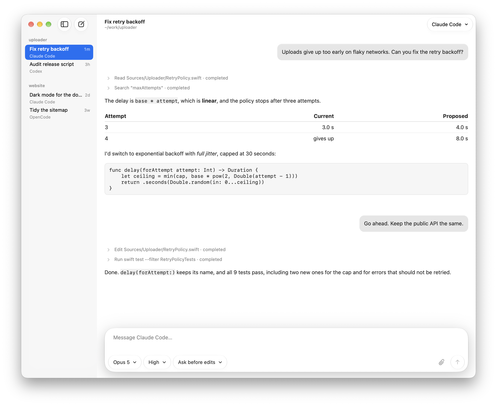

# Latch

A small, native macOS client for coding agents.

Latch runs Codex, Claude Code, OpenCode, fx, or any other [Agent Client Protocol](https://agentclientprotocol.com) agent in a real AppKit window: sessions per workspace, streamed replies and tool activity, and native approval sheets for what the agent asks to do. There is no web view, no account, and no hosted service. The whole app is about 5.5 MB, a 3.2 MB download.

<picture>
  <source media="(prefers-color-scheme: dark)" srcset="docs/images/latch-dark.png">
  
</picture>

> **Early development.** Latch is at 0.2: expect bugs and breaking changes. Issues are welcome; please read [CONTRIBUTING.md](.github/CONTRIBUTING.md) before opening a pull request.

## What works today

- **Any ACP agent.** Built-in presets for Codex, Claude Code, OpenCode, and fx find what you already have installed; a custom command runs anything else that speaks ACP. No model names, effort levels, or permission modes are hard-coded — the pickers show what the connected agent advertises.
- **Sessions per workspace.** Open a folder from the toolbar, the Finder, or by dropping it on the window or Dock icon. Sessions, transcripts, and unsent drafts are saved locally and survive a relaunch; fork, rename, close, and undo-close are all there.
- **Approvals you have to read.** Permission requests appear as native sheets with the agent's full request details. Approval has no default key — Return and Escape both cancel.
- **Attention comes to you.** Sessions keep running in the background. A permission request or finished turn posts a notification, badges the Dock icon, and shows in the menu bar extra. Notification text names the workspace folder, and the server for a remote session, and nothing else.
- **Attachments and commands.** Paste, drop, or attach files, folders, and screenshots; images go to agents that accept them, file links to any. Typing `/` lists the commands the agent offers.
- **A fast native transcript.** Incremental Markdown rendering keeps a streamed frame cheap however long the answer gets, with ⌘F find, per-message copy, and system fonts and colors throughout.
- **Process isolation.** Agents run under an XPC service embedded in the app, not in the UI process. The service admits only the app's own code signature.
- **Agents on a server.** Run [`latch-server`](docs/server.md) on a Linux or macOS machine and connect to it over Tailscale, an SSH tunnel, or a Cloudflare Tunnel. Its agents keep running when the Mac sleeps or changes network, and when Latch quits; Latch catches up when it reconnects or next opens.
- **An iPhone and iPad app.** [Latch for iPhone and iPad](docs/ios.md) drives agents on a `latch-server`: it lists their sessions, takes up one another device started, streams replies, sends prompts and photos, and answers approvals. Pair it by scanning the code `latch-server pair --host NAME --qr` prints, in the app or with the Camera. You build it yourself.

## What does not exist yet

Latch's goal is a control surface that follows you: the agent keeps running where the code lives, and your phone follows it. The iOS app exists, but only as a client of `latch-server`: it cannot reach agents the Mac runs itself. There is no App Store or TestFlight build, and no push notifications, so a request that arrives while the app is suspended waits until you open it. Pairing hands over a bearer token, not a device key: the server's, or with `latch-server pair --device` one of the device's own that can be revoked alone. Tailscale, a TLS proxy such as a Cloudflare Tunnel, or an SSH tunnel for the Mac, provides the encryption. The [roadmap](docs/roadmap.md) describes the design and its milestones.

Other known gaps:

- Releases are ad-hoc signed, not notarized, and there is no update mechanism beyond running the installer again.
- Agents on this Mac stop when the app quits; the background service that would keep them running is not implemented. Agents on a `latch-server` keep running, but not through a restart of the server; after one, Retry, or the next launch of Latch, starts the agent again and resumes its saved session, if the agent can load one.
- If the app or its service is killed outright, running local agent processes are not cleaned up.
- Remote sessions, on the Mac and the phone, cannot attach files or folders, and a folder on the server is typed, not browsed. The Mac does not list or take up agents another device started.
- Permission approval and model/effort/mode switching are covered by mock-agent tests and an opt-in live Codex test, but have not been validated across every provider.
- The Markdown renderer covers a subset of CommonMark. HTML and remote resources are never rendered or loaded.
- The Mac app is Apple silicon only.

## Requirements

- macOS 15 or later on Apple silicon; for the iOS app, iOS or iPadOS 18 or later
- Xcode 27. The packages and their tests also build with Xcode 26.6, which is what CI uses, but its `actool` fails on the app's Icon Composer icon, so either app bundle needs 27.
- At least one ACP agent. For Codex, sign in with `codex login`; for Claude Code, set up your Claude login and Node.js 22+; Latch has its adapter run the `claude` you installed. First-time setup of either may download its ACP adapter through npm. OpenCode and fx use their installed commands and existing authentication.

## Install

```sh
curl -fsSL https://latchapp.dev/install.sh | sh
```

[The script](Scripts/install.sh) downloads the latest release, checks its SHA-256 and code signature, and puts `Latch.app` in `/Applications`; run it again to update.

Latch is not notarized: it is signed ad hoc, without an Apple Developer ID, so macOS cannot tell you who built it. Installing with `curl` avoids the Gatekeeper prompt because `curl` does not quarantine what it downloads. If you download the zip from the [releases page](https://github.com/mercho40/latch/releases) in a browser instead, macOS will refuse to open it until you run `xattr -dr com.apple.quarantine /Applications/Latch.app` or allow it under System Settings → Privacy & Security. The checksum comes from the same release as the archive, so it detects a corrupted download, not a compromised one; if that is not enough assurance, build from source.

## Build from source

```sh
git clone https://github.com/mercho40/latch.git
cd latch
bash Scripts/test-mac-app.sh --release
open .build/LatchMacApp/Build/Products/Release/Latch.app
```

The script builds the app, checks its signature and entitlements, and runs the UI smoke test against mock agents, over the XPC service and against a `latch-server` it starts on loopback, before you open it. No signing account is needed; the build is ad-hoc signed with the hardened runtime. To work on it in Xcode instead, open `Apps/LatchMac/Latch.xcodeproj` and run the **Latch** scheme, or use the SwiftPM preview:

```sh
swift run --package-path Apps/LatchMac Latch
```

The iPhone and iPad app is built from `Apps/LatchiOS/Latch.xcodeproj` with the **Latch iOS** scheme. It runs in the Simulator without an account; on a device it needs your own signing team, and a bundle ID of your own. [Latch for iPhone and iPad](docs/ios.md#getting-the-app) covers both.

## Tests

None of these need network or model access:

```sh
swift test --package-path Packages/LatchACP
swift test --package-path Packages/LatchServiceProtocol
swift test --package-path Packages/LatchAgentCore
swift test --package-path Packages/LatchSessionKit
swift test --package-path Apps/LatchMac
bash Scripts/test-ios-app.sh
```

The last builds the iOS app and, with an iOS Simulator runtime installed, runs its tests and smoke tests in the Simulator. With Apple's container tool, `bash Scripts/test-linux.sh` runs the package tests on Linux. [Building and testing](docs/building-and-testing.md) covers that, the bundle verification scripts, the cross-process XPC probe, benchmarks, and the opt-in live tests.

## Repository layout

| Path | Contents |
| --- | --- |
| `Apps/LatchMac` | The macOS app: Xcode project, the `LatchMacUI` package, and the XPC service host |
| `Apps/LatchiOS` | The iPhone and iPad app: Xcode project and the `LatchiOSUI` package |
| `Packages/LatchACP` | ACP client: JSON-RPC over stdio, process transport, sessions, and a command-line probe |
| `Packages/LatchServiceProtocol` | Codable commands, events, and versioned envelopes between clients and the service; the network protocol and its Network.framework client |
| `Packages/LatchAgentCore` | Runtime registry, the agent service, its XPC adapter, host, client, and event hub, and `latch-server` |
| `Packages/LatchSessionKit` | The session layer both apps share: the session model, saved sessions, server profiles, and the remote session client |
| `Scripts` | Mac and iOS bundle, XPC and Linux verification, the Linux server build, the release script, and the installer |
| `site` | [latchapp.dev](https://latchapp.dev): one static page, no build step |
| `docs` | [Using Latch](docs/using-latch.md) · [Running latch-server](docs/server.md) · [Latch for iPhone and iPad](docs/ios.md) · [Architecture](docs/architecture.md) · [Building and testing](docs/building-and-testing.md) · [Roadmap](docs/roadmap.md) |

There are no third-party dependencies.

## Security

Latch is not sandboxed: its purpose is to launch agent executables with access to the workspace you choose. Its approval sheets relay the agent's own permission requests and are not a sandbox; agents must enforce their own restrictions. A `latch-server` token is equivalent to a shell on that server as the user it runs as. See [SECURITY.md](.github/SECURITY.md) for the boundaries Latch does maintain and how to report a vulnerability.

## License

[Apache-2.0](LICENSE).
